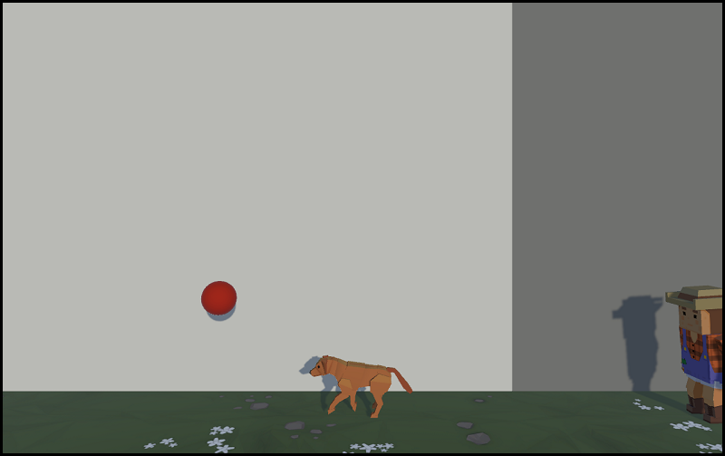
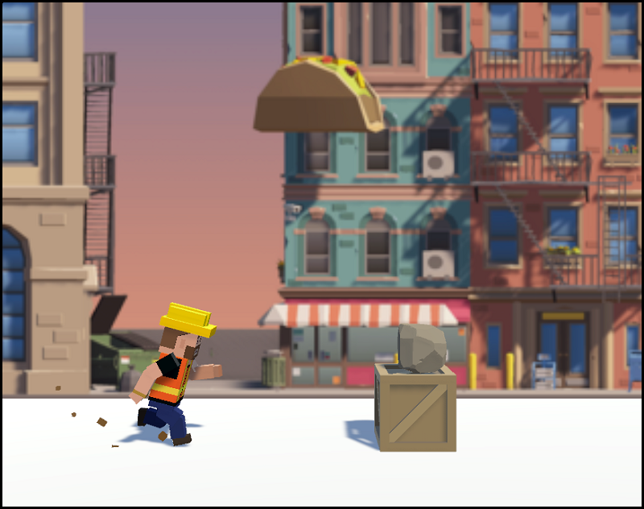
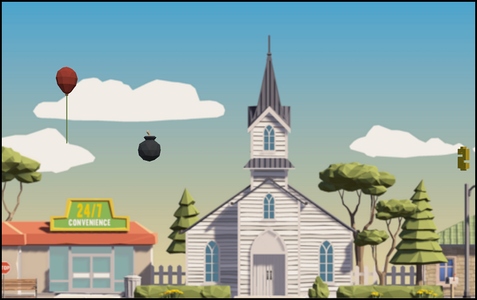
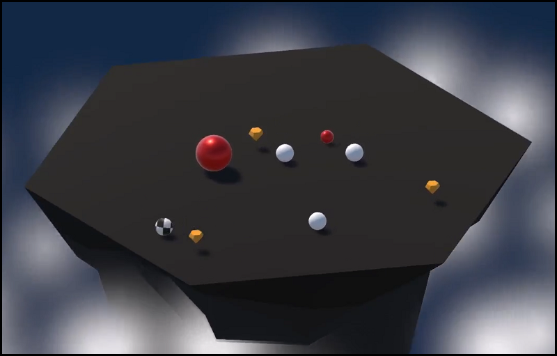
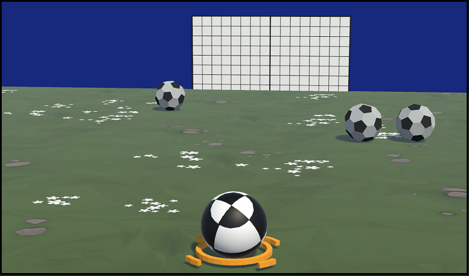
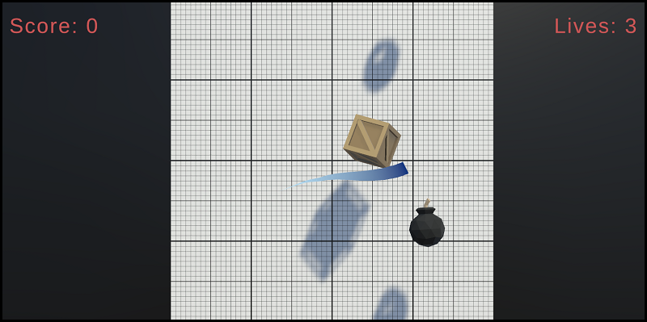
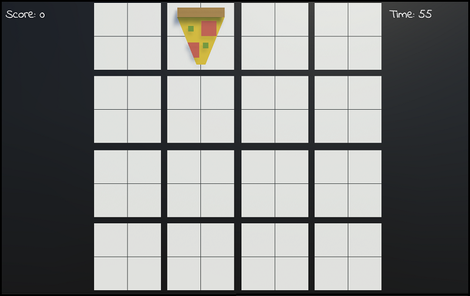
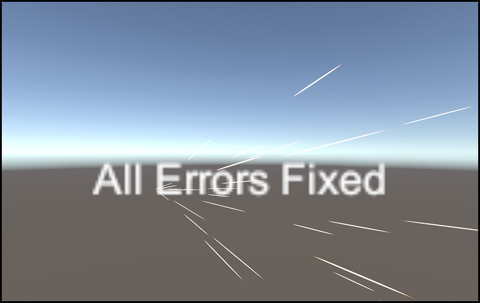
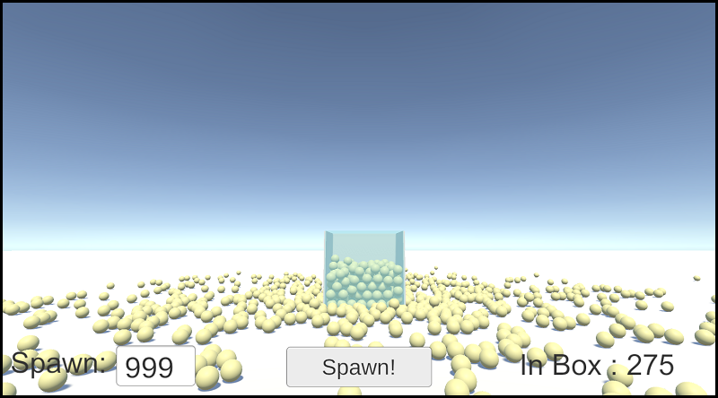

# unity-junior-programmer-course-projects

## Tools

* Unity 2021.3.14f1

 
## Unit 1

### Unit Objective

* Program a car moving side-to-side on a floating road, trying to avoid (or hit) obstacles in the way.
  

  

 
## Challenge 1

### Challenge Objective

* The plane moves forward at a constant rate
* The up/down arrows tilt the nose of the plane up and down
* The camera follows along beside the plane as it flies

  

 
## Unit 2

### Unit Objective

* Allow the player to move forward and backwards, left and right within a certain range.
* Have animals that  spawn from the top and also from the left and right side of the screen.  
* At the start of the game, the player’s Lives = 3 and Score = 0. If the player feeds an animal, increase and display the Score. If the player is hit by a animal (spawn from the left or right side), decrease and display the Lives. When the number of Lives reaches 0, log “Game Over” in the console.
* Display a “hunger bar” on top of each of the animals. Then, each time you feed one of them, the hunger bar fills up a little. Each animal should require different amounts of food to successfully “feed” them

  

## Challenge 2

### Challenge Objective

* Make the balls spawn from the top of the screen
* Make the player spawn dogs
* The balls should only be destroyed when coming into direct contact with a dog
* Balls should be destroyed when they leave the bottom of the screen and dogs should be destroyed when they leave the left side of the screen
* Ball 1, 2, and 3 should be spawned randomly
* Make the spawn interval a random value between 3 seconds and 5 seconds

  
 

## Unit 3

### Unit Objective

 * Repeat background
 * Randomize obstacles
 * Make player jump
 * Adjust the jump animation
 * Double jump
 * Set up a falling animation
 * Super speed ability and score
 * Game start animation
 * Play the particle on collision, add a dirt splatter particle
 * Add music. Play Audio Clips on jump and crash

   
  

## Challenge 3

### Challenge Objective

* The balloon should float up as the player presses spacebar
* The background should move at start, then stop when the game is over
* Make bombs or money objects spawn every few seconds
* Make the fireworks display at the balloon’s position
* Make the background repeat seamlessly
* Prevent the player from floating their balloon too high
* Make the balloon appear to bounce off of the ground, preventing it from leaving the bottom of the screen. There should be a sound effect when this happens!

  
 

## Unit 4

### Unit Objective

* Create enemies
* Add a new more difficult type of enemy and randomly select which is spawned
* Create a powerup that gives the player a temporary strength boost
* Create a powerup that gives the player the ability to launch projectiles at enemies to knock them off
* Create a powerup that allows the player to hop up into the air and smash down onto the ground, sending any enemies nearby flying away from the player
* After a certain number of waves, program a “boss battle”, where the boss has some completely new abilities. It occasionally generates little minions
   

## Challenge 4

### Challenge Objective

* When you hit an enemy, it should send it away from the player
* A new wave should spawn when all enemy balls have been removed
* The powerup should only last for a certain duration, then disappear
* One enemy should be spawned in wave 1, two in wave 2, three in wave 3, etc
* The enemy balls should go towards the “Player Goal” object
* The player should get a speed boost whenever the player presses spacebar - and a particle effect should appear when they use it
* The enemies speed should increase in speed by a small amount with every new wave
   

## Unit 5

### Unit Objective

* Create good and bad targets
* Toss objects randomly in the air
* Destroy target with click and sensor
* Add score when targets are destroyed
* Add a Particle explosion
* Add difficulty buttons 
* Create a "Lives" UI element that counts down by 1 when an object leaves the bottom of the screen and triggers Game Over when Lives reaches 0
* Add background music and a UI Slider element to adjust the volume
* During gameplay, allow the user to press a key to toggle between pausing and resuming the game, where a pause screen comes up while the game is paused
* Program click-and-swipe functionality, generating a trail where the mouse has been dragged
   

## Challenge 5

### Challenge Objective

* Center the text on the buttons horizontally and vertically
* The food should only be destroyed when the player clicks on it, not when the mouse touches it
* It should always say, “Score: __“ with the value displayed after “Score:”
* Make the Restart button appear on the game over screen
* Make the difficulty buttons change the difficulty
* Add a “Time: __” display that counts down from 60 in whole numbers (i.e. 59, 58, 57, etc) and triggers the game over sequence when it reaches 0
   

## Error Project

### Project Objective

* Fix errors
   

## Counter Project

### Project Objective

* Add anything you need to complete the prototype
   

## Data Persistence Project

### Project Objective
