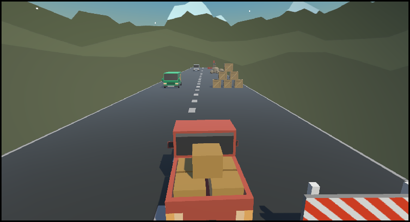
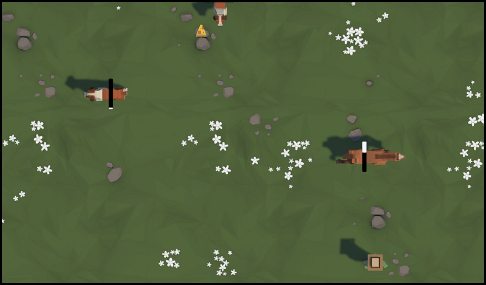

# unity-junior-programmer-course-projects

## Tools

* Unity 2021.3.14f1

 
## Unit 1

### Unit Objective

* Program a car moving side-to-side on a floating road, trying to avoid (or hit) obstacles in the way.
  

  

 
## Challenge 1

### Challenge Objective

* The plane moves forward at a constant rate
* The up/down arrows tilt the nose of the plane up and down
* The camera follows along beside the plane as it flies

  

 
## Unit 2

### Unit Objective

* Allow the player to move forward and backwards, left and right within a certain range.
* Have animals that  spawn from the top and also from the left and right side of the screen.  
* At the start of the game, the player’s Lives = 3 and Score = 0. If the player feeds an animal, increase and display the Score. If the player is hit by a animal (spawn from the left or right side), decrease and display the Lives. When the number of Lives reaches 0, log “Game Over” in the console.
* Display a “hunger bar” on top of each of the animals. Then, each time you feed one of them, the hunger bar fills up a little. Each animal should require different amounts of food to successfully “feed” them

  

## Challenge 2

### Challenge Objective

* Make the balls spawn from the top of the screen
* Make the player spawn dogs
* The balls should only be destroyed when coming into direct contact with a dog
* Balls should be destroyed when they leave the bottom of the screen and dogs should be destroyed when they leave the left side of the screen
* Ball 1, 2, and 3 should be spawned randomly
* Make the spawn interval a random value between 3 seconds and 5 seconds

