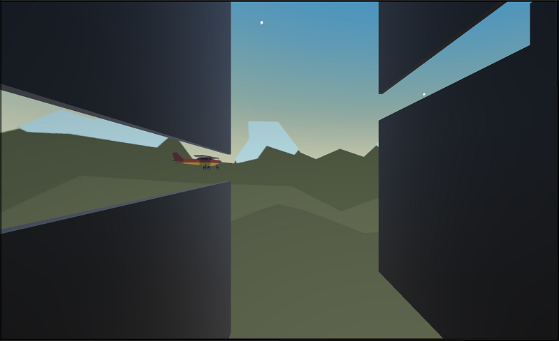

# unity-junior-programmer-course-projects

## Tools

* Unity 2021.3.14f1

 
## Unit 1

### Unit Objective

* Program a car moving side-to-side on a floating road, trying to avoid (or hit) obstacles in the way.
  

  

 
## Challenge 1

### Challenge Objective

* The plane moves forward at a constant rate
* The up/down arrows tilt the nose of the plane up and down
* The camera follows along beside the plane as it flies

  

 
## Unit 2

### Unit Objective

  
